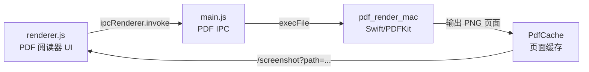

# PDF 原生阅读器开发经验总结

本文记录 Rong VideoPlayer 从“PDF 以内嵌 iframe 预览”演进到“原生 PDF 阅读器”的开发经验。这个功能的目标不是简单把 PDF 文件显示出来，而是让 PDF、学习笔记、视频学习资料在同一个学习工作台里形成更稳定、更可控的阅读体验。

---

## 1. 背景与目标

项目最初可以把 PDF 作为学习资料上传，并通过 `iframe` 嵌入到笔记预览区中展示。这个方案实现成本低，但随着项目逐渐变成一个学习辅助工具，`iframe` 的局限越来越明显：

* **体验不可控**：浏览器内置 PDF 预览器的工具栏、缩放、翻页行为由运行环境决定，很难和应用自身 UI 保持一致。
* **布局受限**：PDF 被塞进笔记编辑器/预览区内部，外层标题栏、编辑区和预览区嵌套过多，真正留给阅读的空间很小。
* **扩展困难**：后续如果要做双页阅读、阅读进度、划线摘录、笔记引用、页面收藏，很难基于 `iframe` 做稳定控制。
* **桌面端特性没有发挥**：当前项目主要面向 macOS 桌面端，可以直接利用系统 PDF 能力，而不是被浏览器预览器限制住。

因此，PDF 原生支持的目标被重新定义为：

* 在应用内直接渲染 PDF 页面。
* 支持类似微信读书的单页/双页阅读、翻页和页码展示。
* 打开 PDF 后自动适配窗口大小，尽量完整展示页面。
* 用户手动缩放后尊重用户选择，不再被窗口 resize 自动覆盖。
* 尽量移除笔记编辑器外层干扰，让 PDF 阅读区域最大化。
* 为后续搜索、标注、摘录、书签和学习笔记联动留下结构空间。

---

## 2. 最终架构

当前实现采用“Electron 渲染进程 + Electron 主进程 IPC + Swift PDFKit 辅助程序”的结构。



关键文件分工如下：

| 文件 | 职责 |
| :--- | :--- |
| `pdf_render_mac.swift` | 调用 macOS PDFKit 读取 PDF 信息、把指定页渲染为 PNG |
| `bin/pdf_render_mac` | 编译后的 PDF 渲染辅助程序 |
| `main.js` | 提供 `pdf-get-info`、`pdf-render-page` IPC；管理 PDF 页面缓存 |
| `renderer.js` | 生成 PDF 阅读器 DOM；处理翻页、缩放、单/双页切换、分类、快捷键 |
| `index.css` | 提供阅读模式布局、双页排版、页面动画、工具栏样式 |
| `package.json` | 通过 `extraResources` 把 `pdf_render_mac` 打包进桌面应用 |

这种结构的优点是职责清晰：

* 前端不直接理解 PDF 格式，只负责展示图片页和交互。
* 主进程负责安全地访问本地文件、创建缓存和桥接系统能力。
* Swift 辅助程序只做一件事：稳定地把 PDF 页面渲染成图片。

---

## 3. PDFKit 辅助程序设计

辅助程序提供两个命令：

```bash
pdf_render_mac info <pdf-path>
pdf_render_mac render <pdf-path> <page-index> <scale> <output-path>
```

`info` 用于读取页数和标题，返回 JSON：

```json
{
  "success": true,
  "pageCount": 120,
  "title": "示例 PDF"
}
```

`render` 用于把某一页渲染成 PNG，并写入缓存目录。Electron 主进程只需要拿到输出路径，再通过已有的本地文件路由展示图片。

一个重要选择是：页面渲染最终使用 `PDFPage.thumbnail(of:for:)`，而不是手动创建 `CGContext` 后调用 `page.draw(with:to:)`。

开发过程中曾经遇到 PDF 页面上下左右都颠倒的问题。原因是 macOS 图形坐标系、PDF 坐标系和位图上下文坐标系不完全一致，手动绘制时很容易出现翻转、镜像、旋转叠加的问题。虽然可以通过 `translateBy`、`scaleBy` 和页面 bounds 做修正，但不同 PDF 的 cropBox、rotation、mediaBox 组合会让这个修正变得脆弱。

改用 `PDFPage.thumbnail(of:for:)` 后，页面旋转、裁切盒和坐标转换交给 PDFKit 自己处理，渲染结果更稳定，也减少了后续维护成本。

---

## 4. 主进程 IPC 与缓存策略

主进程新增两个核心 IPC：

* `pdf-get-info`：校验文件存在和扩展名，调用 Swift 辅助程序读取 PDF 页数、标题。
* `pdf-render-page`：校验页码和缩放比例，计算缓存路径，必要时调用 Swift 辅助程序渲染页面。

缓存目录位于：

```text
userData/PdfCache
```

缓存 key 包含这些因素：

* 缓存版本号
* PDF 文件路径
* 文件大小
* 文件修改时间
* 页码
* 渲染 scale

这样可以避免同一页重复渲染，也能在 PDF 文件变化后自动生成新的缓存。

这里有一个实际踩坑：修复页面颠倒问题后，旧缓存里仍然可能保留错误方向的页面图片。如果缓存 key 不变，界面看起来就像修复没有生效。因此增加了 `PDF_RENDER_CACHE_VERSION`，通过提升版本号强制旧缓存失效。这类“渲染逻辑变化但源文件没变”的场景，都需要缓存版本参与失效控制。

---

## 5. 渲染进程阅读器交互

渲染进程负责把 PDF 资料变成一个 `.pdf-native-reader` 阅读器组件。上传 PDF 时，不再插入 `iframe`，而是插入带有 PDF 路径和标题的数据块；打开笔记时再初始化阅读器。

阅读器主要维护这些状态：

* `pageCount`：总页数。
* `currentPage`：当前左页或当前单页页码。
* `pageMode`：`single` 或 `double`。
* `zoom`：当前显示比例。
* `manualZoom`：用户是否手动缩放过。
* `renderScale`：传给底层渲染器的图片清晰度比例。
* `pageAspectRatio`：页面宽高比，用于自适应计算。

### 5.1 单页与双页模式

双页模式下，每次展示 `currentPage` 和 `currentPage + 1`。翻页步长为 2。

单页模式下，只展示 `currentPage`。翻页步长为 1。

工具栏只保留一个切换按钮，点击后在单页和双页之间切换。无论是哪种模式，都优先把页面完整放进当前阅读区域。

### 5.2 自动适配与手动缩放

PDF 打开后会根据阅读区域大小计算缩放比例：

* 可用宽度 = 阅读区域宽度 - padding - 双页间距。
* 可用高度 = 阅读区域高度 - padding - 页码区域预留高度。
* 双页模式按两页总宽度计算。
* 单页模式按一页宽度计算。
* 最终取宽度缩放和高度缩放中的较小值，保证页面完整展示。

这里的关键是区分“系统自动适配”和“用户手动缩放”。

如果用户没有手动缩放，窗口大小变化时通过 `ResizeObserver` 重新计算比例，让 PDF 始终完整展示。

如果用户点击了放大/缩小按钮，则把 `manualZoom` 设为 `true`。之后即使窗口大小变化，也不再自动覆盖用户选择的比例。这个细节很重要，因为阅读工具里“我刚调好的大小突然被系统改掉”是非常明显的体验破坏。

### 5.3 页码位置

页码最初显示在页面上方，看起来像页面内容被工具栏压住。后来调整为每页图片下方显示：

```html

<div class="pdf-page-number">第 1 页</div>
```

这样更符合阅读习惯，也避免页码和页面正文发生视觉冲突。

### 5.4 快捷键

PDF 阅读模式下支持键盘翻页：

* `ArrowLeft`：上一页/上一组页面。
* `ArrowRight`：下一页/下一组页面。
* `Space`：下一页/下一组页面。

快捷键需要注意输入框场景。如果用户正在页码输入框、分类下拉框或其他可编辑元素中操作，不应该拦截键盘事件，否则会破坏表单输入体验。

### 5.5 翻页稳定性：不闪烁、不位移

PDF 翻页体验连续修了两轮，最后沉淀出一个很实用的原则：**页面主体不要参与会改变布局位置的动画，页面替换也不要先清空 DOM**。

第一轮问题是“闪烁”。原因是翻页时先执行了类似这样的流程：

```javascript
slot.innerHTML = `<div class="pdf-page-loading">正在渲染第 ${pageNumber} 页...</div>`;
// 等待主进程渲染 PNG
slot.innerHTML = ``;
```

这会让旧页面先消失，中间出现 loading 或空白，再显示新页面。即使渲染很快，人眼也会感知到页面闪一下。

解决方式是改成“旧页保持显示，新页后台准备好后再替换”：

* 如果 slot 中已经有旧页面，翻页时不清空它。
* 先通过 IPC 请求新页 PNG。
* 拿到图片路径后创建 `Image()` 对象预加载。
* 图片 `onload` 后再尽量调用 `img.decode()`，确保浏览器已经可以绘制它。
* 只有新图确认可显示时，才用 `replaceChildren()` 替换旧页面。
* 如果新页渲染失败，旧页继续留在屏幕上，只叠加一个错误提示。

这个方案的关键不是“加载更快”，而是“加载期间不破坏当前视觉状态”。对阅读器来说，旧页停留比空白闪烁要自然得多。

第二轮问题是“页面位移一下再恢复”。闪烁消失后，翻页仍然会看到 PDF 页面横向偏移。这里有两个原因：

* 翻页动画本身使用了 `translateX`、`rotateY`、`scale`，页面主体会先偏移再回到原位。
* 新页面加载完成后再次触发 `applyAutoFit()`，可能根据新页宽高比重新计算 `--pdf-page-zoom`，造成一次很轻微的缩放/布局抖动。

最终处理方式是：

* 普通翻页过程中不再触发二次自动适配，只在首次打开、窗口 resize、单/双页切换等需要重新布局的场景计算比例。
* 页面主体 `.pdf-page-content` 不再使用 `translateX`、`rotateY` 这类会改变视觉位置的动画。
* 翻页反馈改成原地亮度过渡，加一层 `::after` 扫光遮罩。遮罩可以移动，但 PDF 页面本身不移动。

也就是说，真正稳定的翻页动效应该遵守这条边界：

* **可以动装饰层**：扫光、阴影、轻微亮度、透明度。
* **不要动内容层**：PDF 图片本身不平移、不旋转、不缩放。
* **不要在换页完成后重算布局**：除非用户改变窗口、切换单双页或首次打开。

这样既保留了翻页反馈，又不会让文字和页面边缘产生“抖一下”的感觉。

---

## 6. 阅读模式布局优化

PDF 原生阅读器最明显的一次体验提升来自布局调整。

在普通笔记编辑模式下，右侧区域有笔记标题、编辑器、预览区等结构。PDF 如果继续待在这些嵌套容器里，即使能渲染双页，也会被压得很小。

因此引入了 `pdf-reading-mode`：

* 隐藏笔记编辑器中与阅读无关的标题栏、编辑器和外层装饰。
* 让 PDF 阅读器直接占据主要内容区。
* 保留必要的 PDF 工具栏，包括返回、翻页、缩放、系统打开、分类、单/双页切换。
* 调整工具栏左侧间距，避免和左侧侧边栏收缩按钮重叠。

这个调整说明一个经验：阅读类功能不能只看“功能是否能用”，还要看内容是否获得了足够的视觉空间。PDF 是长时间阅读对象，外层 UI 的每一层冗余都会被用户持续感知。

---

## 7. 与笔记系统的结合

PDF 在项目里不是孤立阅读器，而是学习资料的一种。它需要和笔记系统保持关系：

* 上传 PDF 后会作为学习资料进入笔记内容。
* PDF 阅读器顶部可以选择笔记分类。
* 分类选择和笔记当前分类保持同步。
* 老的 `iframe` PDF 内容会在打开时升级为新的 `.pdf-native-reader`。

兼容旧数据很重要。已有用户笔记里可能已经保存了 `iframe` 形式的 PDF，如果直接废弃，会造成旧资料无法获得新体验。通过“打开时迁移”的方式，可以让历史内容逐步过渡到原生阅读器。

---

## 8. 开发中的主要经验

### 8.1 原生能力适合作为小工具封装

Electron 项目不一定要把所有能力都塞进 Node.js 或前端。对于 macOS 桌面应用，PDFKit 是成熟稳定的系统能力。把它封装成一个小型命令行辅助程序，再通过主进程调用，是一个性价比很高的方案。

这种方式比引入复杂 PDF 前端库更轻量，也更容易控制打包和运行环境。

### 8.2 不要低估坐标系问题

PDF 渲染最大坑点不是“能不能画出来”，而是“画出来的方向是否永远正确”。手写 CGContext 变换在简单 PDF 上可能正常，在带旋转、裁切或特殊页面盒的 PDF 上就可能翻车。

对于这类底层图形问题，优先使用更高层、更语义化的系统 API，往往比自己拼矩阵更可靠。

### 8.3 缓存必须能随渲染逻辑失效

缓存 key 只绑定文件本身是不够的。只要渲染逻辑、输出尺寸、页面方向修正、图片格式策略发生变化，都可能需要让旧缓存失效。增加显式缓存版本号，可以避免很多“代码已经修了但界面没变”的排查成本。

### 8.4 阅读器需要尊重用户的缩放意图

自动适配解决的是首次打开和窗口变化问题；手动缩放解决的是用户偏好问题。两者不能混在一起。

实现上用 `manualZoom` 明确标记用户是否介入过缩放，是一个简单但有效的状态设计。

### 8.5 布局优化和功能开发同样重要

PDF 阅读器已经渲染成功，并不代表功能完成。如果它被层层容器压缩，只能显示很小的页面，那么用户仍然不会觉得这是一个阅读器。

为 PDF 单独提供阅读模式，让内容区域最大化，是这个功能从“可用”走向“像阅读工具”的关键一步。

### 8.6 阅读器动画应该优先保证内容稳定

普通 UI 动画可以大胆一些，但阅读器里的动画必须更克制。PDF 页面承载的是正文内容，用户的注意力落在文字、图表和页边距上，任何轻微位移都会被感知成抖动。

这次翻页优化的经验是：先解决视觉连续性，再考虑动效表现。

具体实现顺序应该是：

1. 旧页面保持显示。
2. 新页面异步渲染并预加载。
3. 新页面可绘制后再原子替换 DOM。
4. 页面主体保持原位。
5. 用装饰层表达翻页反馈。

这比直接给页面加 `transform` 动画更稳，也更适合长期阅读场景。

---

## 9. 验证方式

开发过程中主要使用以下方式验证：

```bash
node --check main.js
node --check renderer.js
git diff --check
./bin/pdf_render_mac info <pdf-path>
./bin/pdf_render_mac render <pdf-path> 0 2 <output-path>
```

其中 Swift 渲染器的验证不能只看命令是否成功，还需要实际打开输出 PNG，确认：

* 页面方向正常。
* 内容没有镜像。
* 页码对应正确。
* 图片清晰度可接受。
* 缓存命中后仍能正常显示。

---

## 10. 后续可以继续优化的方向

PDF 原生阅读器目前已经具备阅读基础能力，但它还能继续向“学习型阅读器”演进：

* **全文搜索**：提取 PDF 文本，支持在书内搜索关键词。
* **划线与摘录**：支持高亮、下划线、复制摘录到学习笔记。
* **阅读进度**：记录每个 PDF 上次阅读页码和阅读百分比。
* **书签与收藏页**：快速回到重点章节或页面。
* **缩略图/目录侧栏**：提供页面缩略图和 PDF outline 目录导航。
* **笔记引用**：让笔记可以引用“某个 PDF 的第几页/某段摘录”。
* **更真实的实体翻页**：在不移动 PDF 内容主体的前提下，继续增强纸张阴影、页边层次和双页阅读的实体书感。
* **缓存清理策略**：按时间、大小或最近使用情况清理旧页面缓存。
* **OCR 联动**：对扫描版 PDF 做 OCR，纳入统一学习资料检索。

---

## 11. 小结

这次 PDF 原生支持的核心收获是：学习辅助工具里的 PDF 不是附件预览，而是高频学习场景的一部分。它需要有稳定的渲染、足够大的阅读空间、顺手的翻页和缩放，以及和笔记分类体系的连接。

从实现上看，比较稳妥的路线是：

1. 用系统 PDFKit 解决 PDF 页面渲染。
2. 用 Electron 主进程做文件访问、缓存和 IPC 边界。
3. 用渲染进程专注阅读器 UI 和学习交互。
4. 用阅读模式减少外层 UI 干扰。
5. 用明确的状态区分自动行为和用户意图。

这个基础打好后，后续的搜索、摘录、标注和知识复盘功能才能自然接上。
