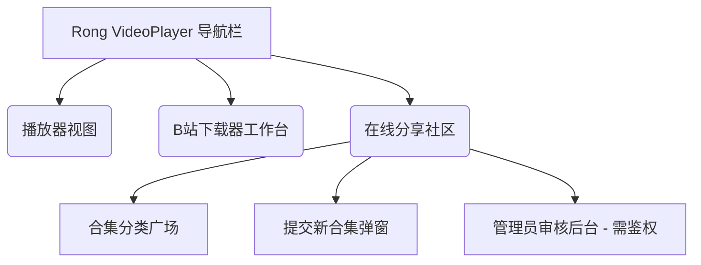
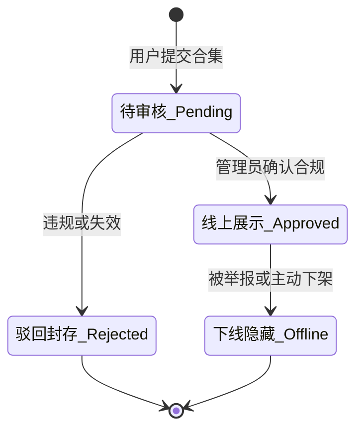

# Rong VideoPlayer - 在线视频分享社区产品设计方案

本方案旨在为 **Rong VideoPlayer** 引入一个创新的“在线视频分享社区”功能。该功能借鉴了网易云音乐“歌单/合集”的社交与内容沉淀属性，允许用户分享自己收藏、整理的高清视频合集（如：系列教程、影视合集、动漫合集等），提供分类浏览、一键导入播放或下载的功能。同时，为了规范社区内容，系统内置了超级管理员审核平台。

---

## 1. 核心需求与设计愿景

Rong VideoPlayer 作为一个本地桌面播放器，拥有强大的流媒体播放和批量下载能力。在线分享社区将打通本地与线上，实现：
* **从工具到平台的跃迁**：用户不再仅仅自己看视频、自己下载视频，而是可以将优质的内容合集“打包分享”给其他用户。
* **一键打通播放/下载链**：浏览到他人分享的合集后，点击“一键播放”即可拉起流媒体解析，点击“一键下载”即可导入本地批量下载队列。
* **中式美学融合**：页面布局将继承播放器现有的“中国传统色彩”换肤方案（玄天、竹翠、缃叶、黛墨、凝脂），呈现高保真毛玻璃毛流光效与版式设计。

---

## 2. 核心功能模块

### 模块一：合集分享与提交 (User Submission Portal)
用户在客户端的社区页面点击“分享合集”，填写并提交合集内容：
* **合集基础信息**：标题（Title）、描述（Description）、分类（Category）。
* **合集封面（Cover Image）**：支持用户上传本地图片，或者输入封面 URL。
* **视频源提交**：
  * 支持输入 Bilibili 的合集/视频链接（如 UGC 投稿、合集、多 P），系统将自动调用解析器抓取每集的子标题、CID 和 BVID。
  * 支持提交自定义的网络 M3U8 / MP4 直链列表（格式为：`名称,URL` 一行一个）。
* **分类标签**：支持选择系统内置分类（如：科技、学习、影视、动漫、生活、其他）。

### 模块二：分类合集浏览与一键联动 (Classified Browsing Grid)
主页面采用类似网易云音乐“歌单广场”的瀑布流卡片设计：
* **分类导航栏**：顶部横向排列分类标签（全部、科技商务、学术研讨、影音娱乐、国漫番剧、日常生活）。
* **排序与搜索**：支持按“最多推荐 (Likes)”、“最新发布 (Newest)”、“最多导入”进行排序，并配有检索框。
* **合集详情弹窗 / 页面**：
  * 显示该合集的封面、贡献者头像、简介、视频集数列表。
  * **一键导入播放 (Import & Play)**：点击后，播放器自动将该合集所有视频加入右侧临时播放列表，并立即加载第一集进行转码/流式播放。
  * **一键批量下载 (Import & Download)**：点击后，合集所有集数直接导入我们的 Bilibili 下载工作台工作流中，自适应创建子文件夹并加入排队下载队列。

### 模块三：超级管理员审核系统 (Super Admin Portal)
为了保证线上内容的安全合规，只有通过管理员审核的合集才会出现在公共广场中：
* **安全入口**：可通过客户端隐秘入口（如：按特定快捷键或点击版本号 5 次）唤起管理员登录弹窗，输入账号密码登录后台。
* **待审大厅 (Audit Dashboard)**：
  * 列表展示所有处于 `Pending`（待审核）状态的合集。
  * 审核人员可展开查看合集内的所有分 P 视频标题及原始 URL，进行风险评估。
* **一键决议**：
  * **批准 (Approve)**：状态转为 `Approved`，合集即刻在公共广场上线。
  * **驳回 (Reject)**：状态转为 `Rejected`，需填写驳回原因（如：链接失效、内容违规等），并在后台归档。
* **分类管理 (Category Management)**：支持管理员增、删、改、查公共分类。

---

## 3. 界面架构与用户旅程

### 3.1 客户端交互区域布局 (Wireframe Layout)

在线社区被集成在客户端的独立页签内（点击左侧导航栏的社区按钮切换）：



### 3.2 共享合集卡片状态流转关系 (Collection State Lifecycle)



---

## 4. UI 视觉交互草图 (Mermaid UI Mockups)

### 4.1 在线合集广场主界面

```
+----------------------------------------------------------------------------------+
|  [Rong VideoPlayer]                                                     [ 切换皮肤 ] |
+----------------------------------------------------------------------------------+
|  [播放器]  |  [ 分类广场 ]  [ 最新推荐 ]  [ 学习教程 ]  [ 电影合集 ]        [ 🔍 搜索合集 ]  |
|  [下载器]  |  +---------------------------------------------------------------+  |
|  [社区★]   |  |                                                               |  |
|  ----------|  |  +------------------+  +------------------+  +--------------+ |  |
|  [登录B站] |  |  | [封面图]         |  | [封面图]         |  | [封面图]     | |  |
|  [用户头像]|  |  |                  |  |                  |  |              | |  |
|            |  |  | 考研数学精讲课    |  | Web前端实战大课  |  | 经典科幻合集  | |  |
|  [目录树]  |  |  | By @学霸君 (120P) |  | By @开源大师 (45P)|  | By @影评人 (8P)| |  |
|  - 课程    |  |  +------------------+  +------------------+  +--------------+ |  |
|  - 电影    |  |                                                               |  |
|            |  |  [➕ 分享我的合集]                              [⚙️ 管理员入口]  |  |
|            |  +---------------------------------------------------------------+  |
+----------------------------------------------------------------------------------+
```

### 4.2 管理员审核大厅界面

```
+----------------------------------------------------------------------------------+
|  [ 管理员审核后台 ]                                                 [ 退出登录 ]  |
+----------------------------------------------------------------------------------+
|  待审核合集 (3) | 已批准历史 (142) | 分类设置                                       |
|  ==============================================================================  |
|  1. 标题: "哈利波特 1-8 4K 高码直链" | 分类: 影音娱乐 | 提交人: @电影爱好者              |
|     简介: "收集了全网最清晰的 4K H.265 合集，支持 macOS 原生加速..."                |
|     列表: [P1 魔法石] [P2 密室] [P3 阿兹卡班] [P4 火杯] ...                          |
|     [ 绿色 - 批准上线 ]   [ 红色 - 驳回提交 (需输入理由) ]                           |
|  ------------------------------------------------------------------------------  |
|  2. 标题: "Vue3 + TS 企业级项目实战" | 分类: 学习教程 | 提交人: @开发者小白              |
|     简介: "B站 BVID: BV1xx411xx 批量下载归档"                                      |
|     [ 绿色 - 批准上线 ]   [ 红色 - 驳回提交 ]                                       |
+----------------------------------------------------------------------------------+
```

---

## 5. 数据模型与 API 接口设计

为支持这一线上功能，我们需要一套极简的高性能 RESTful API 服务层（可采用 Node.js + Express + SQLite 快速实现本地或云端架设）：

### 5.1 数据库结构 (Schema)

#### 1. 合集主表 `collections`
| 字段名 | 类型 | 说明 |
| :--- | :--- | :--- |
| `id` | INTEGER (PK) | 唯一自增 ID |
| `title` | TEXT | 合集名称 |
| `description`| TEXT | 合集介绍与寄语 |
| `cover_url` | TEXT | 封面海报图片链接 |
| `category` | TEXT | 所属类别 (e.g. `study`, `movie`) |
| `creator` | TEXT | 创作者昵称 / ID |
| `likes` | INTEGER | 推荐票数 (默认 0) |
| `status` | TEXT | 审核状态: `pending`, `approved`, `rejected` |
| `reject_reason`| TEXT| 驳回理由 |
| `created_at` | DATETIME | 提交时间 |

#### 2. 合集视频分集明细 `collection_items`
| 字段名 | 类型 | 说明 |
| :--- | :--- | :--- |
| `id` | INTEGER (PK) | 唯一自增 ID |
| `collection_id`| INTEGER (FK)| 关联的合集 ID |
| `title` | TEXT | 分集标题 (e.g. `第一讲：导数概念`) |
| `index` | INTEGER | 分集序号 (P1, P2) |
| `bvid` | TEXT | 针对B站的 Bvid (可选) |
| `cid` | TEXT | 针对B站的 Cid (可选) |
| `url` | TEXT | 针对第三方直链 of M3U8/MP4 地址 (可选) |

---

### 5.2 核心 API 接口端点 (Endpoints)

#### 1. 提交合集
* **URL**: `/api/collections`
* **Method**: `POST`
* **Payload**:
  ```json
  {
    "title": "B站最强 Rust 语言基础教程",
    "description": "精选自B站系列基础教程，适合零基础极速入门 Rust 程序设计...",
    "cover_url": "https://images.example.com/rust.jpg",
    "category": "学习教程",
    "creator": "Rust工程师",
    "items": [
      { "title": "P1 Rust 安装与编译环境配置", "index": 1, "bvid": "BV1Y7411K7Jd", "cid": "16578491" },
      { "title": "P2 Rust 基础语法：变量与所有权", "index": 2, "bvid": "BV1Y7411K7Jd", "cid": "16578920" }
    ]
  }
  ```

#### 2. 分类拉取合集列表
* **URL**: `/api/collections?category={category}&sort={sort}&keyword={keyword}&page={page}`
* **Method**: `GET`
* **Response**: 返回已审核通过 (`approved`) 的合集数组及分页信息。

#### 3. 获取合集详细分集列表
* **URL**: `/api/collections/{id}/items`
* **Method**: `GET`

#### 4. 管理员登录与鉴权
* **URL**: `/api/admin/login`
* **Method**: `POST`
* **Payload**: `{ "username": "admin", "password": "securepassword" }`
* **Response**: 返回用于请求头校验的 `jwt_token` 或 `session_key`。

#### 5. 管理员决议审核
* **URL**: `/api/admin/collections/{id}/audit`
* **Method**: `PUT`
* **Payload**:
  ```json
  {
    "status": "approved", // or "rejected"
    "reject_reason": ""  // or 违规原因描述
  }
  ```

---

## 6. 后续开发规划与步骤建议

1. **第一阶段：在客户端开辟“在线社区”入口与框架搭建**
   * 在 [index.html](file:///Users/feng/Work/VideoPlayer/index.html) 左侧栏增加一个“在线广场”切换项。
   * 设计配套的社区骨架屏及 5 套传统色毛玻璃 CSS 样式。
2. **第二阶段：本地 Mock 数据对接与界面渲染**
   * 在 `renderer.js` 中开发卡片广场渲染、提交弹窗表单、管理员登录 Modal 的 DOM 生成与控制代码。
   * 先期使用一份本地 JSON 虚拟数据，打通“点击合集 ➡️ 一键播放”和“点击合集 ➡️ 一键导入 B站下载工作台”的交互链路。
3. **第三阶段：开发独立的服务端后台并真联调**
   * 编写极简 of RESTful 后端项目并部署（或以 Electron 内置嵌入式 SQLite 的形式提供局域网级共享）。
   * 将本地 Mock 数据源替换为真实的 `fetch()` 网络接口请求，完成端到端的合集分享与安全审核闭环。
