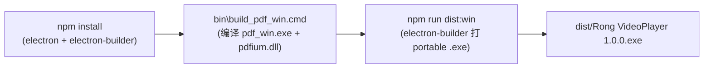
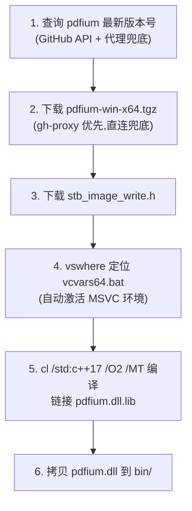

# Windows 客户端构建全流程经验总结

本文记录 Rong VideoPlayer 从“macOS-only”扩展到“Windows portable 单文件版本”的完整构建过程。重点不是讲设计决策（那是另一篇文章），而是把**编译环境怎么搭、依赖从哪里下、环境变量怎么配、构建命令是什么、每一步踩过哪些坑**完整沉淀下来，让任何人（包括未来的自己）拿一台干净的 Windows 机器都能照着复现一次。

最终产物：`dist/Rong VideoPlayer 1.0.0.exe`，约 78 MB 的 portable 单文件，双击即用，数据写入 exe 同级 `data/` 目录。

---

## 1. 总体构建链路

整个 Windows 构建分三段，前一段是后一段的前置条件：



关键认知：**第二段必须先于第三段执行**。`package.json` 的 `win.extraResources` 引用了 `bin/pdf_win.exe` 和 `bin/pdfium.dll`，electron-builder 在打包阶段会校验源文件存在，缺失则直接报错。所以原生 PDF 辅助程序必须先编译出来。

---

## 2. 编译环境搭建

### 2.1 必备软件清单

| 软件 | 版本要求 | 用途 | 下载来源 |
| :--- | :--- | :--- | :--- |
| Node.js | v18+（推荐 v20 LTS） | 跑 electron / electron-builder | https://nodejs.org/ |
| Visual Studio 2022 | Community（免费）即可 | 提供 MSVC v143 工具链，编译 pdf_win.exe | https://visualstudio.microsoft.com/zh-hans/downloads/ |
| FFmpeg | 任意较新版本（含 ffmpeg.exe + ffprobe.exe） | 视频转码、Bilibili 下载合并 | https://www.gyan.dev/ffmpeg/builds/ 或 https://github.com/BtbN/FFmpeg-Builds/releases |
| Git for Windows | 任意版本 | 提供 bash + tar.exe（解压 pdfium） | https://git-scm.com/download/win |
| Windows 10 / 11 | x64 | 运行环境 | — |

### 2.2 Visual Studio 2022 的组件选择

安装 VS 2022 时，**必须**勾选 **“使用 C++ 的桌面开发”（Desktop development with C++）** 工作负载。这个工作负载会装上：

- MSVC v143 编译器（`cl.exe`）
- Windows SDK
- `vcvars64.bat`（设置编译环境的批处理，我们的构建脚本靠 `vswhere.exe` 自动定位它）

不需要勾 C#、.NET、Python 这些，能省好几个 GB。

验证安装成功：在普通 cmd 里跑 `"%ProgramFiles(x86)%\Microsoft Visual Studio\Installer\vswhere.exe" -latest -property installationPath`，能输出 VS 安装路径就说明 `vswhere` 可用，构建脚本能自动找到 MSVC。

### 2.3 FFmpeg 的安装

FFmpeg 是**运行时依赖**，不打包进应用（体积太大且版本敏感）。用户机器上需要有 `ffmpeg.exe` 和 `ffprobe.exe` 能被找到。

推荐方式（选其一）：

```bash
# 方式 A：winget（Windows 10 1809+ 自带）
winget install Gyan.FFmpeg

# 方式 B：scoop
scoop install ffmpeg

# 方式 C：手动下载解压，把 bin 目录加到 PATH
#   下载 ffmpeg-master-latest-win64-gpl-shared.zip（gyan.dev）
#   解压到 C:\opt\ffmpeg\，把 C:\opt\ffmpeg\bin 加进系统 PATH
```

主进程的 `resolveBinaryPath()` 会按以下顺序找 ffmpeg：

1. `where ffmpeg`（系统 PATH）
2. 打包目录 `resources/bin/`
3. `%PROGRAMFILES%\ffmpeg\bin\`、`%PROGRAMFILES(X86)%\...\bin\`、`%LOCALAPPDATA%\...\bin\`、`%CHOCOLATEYINSTALL%\bin\`、`%SCOOP%\shims\` 等常见安装位置
4. 兜底：裸名 `ffmpeg.exe`，交给 spawn 时再按 PATH 解析

只要 ffmpeg 在 PATH 里，或装在上面这些常见路径下，应用就能自动找到。**实测**：本机 ffmpeg 装在 `C:\opt\ffmpeg-master-latest-win64-gpl-shared\bin\ffmpeg.exe`，应用启动后立刻就定位到了。

---

## 3. 网络环境：镜像配置（国内必看）

这一步是**整个构建里最容易卡住的地方**。electron 和 electron-builder 的二进制都托管在 GitHub / Amazon S3 上，国内直连基本超时。表现为：

- `npm install` 跑了 30 分钟还在转，`node_modules/electron/dist/electron.exe` 始终不存在
- electron-builder 打包时卡在 `downloading url=https://github.com/electron-userland/electron-builder-binaries/...`

### 3.1 两个必须设置的镜像环境变量

每次开新的终端窗口跑构建前，先 export（bash）或 set（cmd）：

```bash
# bash (Git Bash / WSL)
export ELECTRON_MIRROR=https://npmmirror.com/mirrors/electron/
export ELECTRON_BUILDER_BINARIES_MIRROR=https://npmmirror.com/mirrors/electron-builder-binaries/
```

```cmd
:: cmd
set ELECTRON_MIRROR=https://npmmirror.com/mirrors/electron/
set ELECTRON_BUILDER_BINARIES_MIRROR=https://npmmirror.com/mirrors/electron-builder-binaries/
```

- `ELECTRON_MIRROR`：让 electron 的 post-install 脚本从淘宝镜像下载 Electron 二进制（`node_modules/electron/dist/electron.exe`，约 100 MB）
- `ELECTRON_BUILDER_BINARIES_MIRROR`：让 electron-builder 从淘宝镜像下载 `winCodeSign`、`nsis`、`nsis-resources` 等打包工具链

想永久生效，把它们加到系统环境变量里（“此电脑 → 属性 → 高级系统设置 → 环境变量”）。

### 3.2 electron 安装损坏的修复方法

如果之前没设镜像就跑过 `npm install`，electron 的二进制多半没下成功（但 npm 不报错，因为 post-install 失败被吞了）。症状：

```
node_modules/electron/index.js:17
    throw new Error('Electron failed to install correctly, please delete node_modules/electron and try installing again');
```

修复（必须带镜像）：

```bash
rm -rf node_modules/electron
export ELECTRON_MIRROR=https://npmmirror.com/mirrors/electron/
npm install electron
```

验证：`node_modules/.bin/electron --version` 应输出 `v33.x.x`，且 `node_modules/electron/dist/electron.exe` 存在。

### 3.3 GitHub Release 资源代理

pdfium 的二进制托管在 GitHub Release（`github.com/bblanchon/pdfium-binaries/releases`）。GitHub API（`api.github.com`）国内通常能通，但 Release 资源会 302 跳到 `objects.githubusercontent.com`，**这个域名国内基本打不开**。

`bin/build_pdf_win.cmd` 里内置了 `gh-proxy.com` 作为 GitHub 资源代理，并带直连兜底：

```cmd
set "GH_PROXY=https://gh-proxy.com/"
:: 优先走代理，失败再直连
powershell ... "try { Invoke-WebRequest '%GH_PROXY%!ASSET_URL!' ... } catch { Invoke-WebRequest '!ASSET_URL!' ... }"
```

如果 `gh-proxy.com` 不可用，可以替换成其它 GitHub 代理：`ghproxy.net`、`ghfast.top` 等（本文写作时 `gh-proxy.com` 实测可用，下载 3.7 MB 的 pdfium 包秒下）。

---

## 4. 原生 PDF 辅助程序编译（pdf_win.exe）

macOS 版用 Apple PDFKit（`pdf_render_mac.swift`），Windows 上没有等价系统库，需要自己编译一个。技术选型：**pdfium**（Google 的 PDF 引擎，Chrome 自己也用它）+ **stb_image_write**（单头 PNG 编码库）。

### 4.1 依赖来源

| 依赖 | 来源 | 体积 | 说明 |
| :--- | :--- | :--- | :--- |
| pdfium 静态/动态库 | `bblanchon/pdfium-binaries` GitHub Release | ~3.7 MB（tgz） | 社区维护的 pdfium 预编译版，按 chromium 版本号发布 |
| stb_image_write.h | `nothings/stb` GitHub（raw） | ~70 KB | 单头文件，PNG 编码 |

> ⚠️ **重要**：pdfium-binaries 的发行版是 **DLL 版**（`bin/pdfium.dll` + 导入库 `lib/pdfium.dll.lib`），不是静态库。所以最终 `pdf_win.exe` 要动态链接 `pdfium.dll`，**两个文件必须一起打包**。

### 4.2 build_pdf_win.cmd 工作流程

构建脚本 `bin/build_pdf_win.cmd` 是可重复执行的，按 6 步走：



关键点：

- **版本号动态获取**：通过 GitHub API 取 `releases/latest` 的 `tag_name`（写作时是 `chromium/7920`），不硬编码。这样脚本不会因为版本过期而失效。
- **MSVC 环境自动激活**：不需要开“开发者命令提示符”。脚本用 `vswhere.exe` 找到 VS 安装路径，再 `call vcvars64.bat` 把 `cl.exe` 等加进 PATH。
- **静态 CRT（`/MT`）**：编译出的 `pdf_win.exe` 不依赖 vcruntime redist，单独拷到任何机器都能跑。
- **产物落位**：`bin/pdf_win.exe`（326 KB，纯 wrapper）+ `bin/pdfium.dll`（7.2 MB，引擎本体）。

### 4.3 运行构建脚本

```cmd
bin\build_pdf_win.cmd
```

脚本幂等：pdfium 和 stb 已经在 `bin/win-build/` 下时跳过下载，只重新编译。首次跑会下载依赖（约 4 MB），耗时 1–2 分钟；后续重编只要几秒。

### 4.4 冒烟测试

编译完一定要测一下两个子命令（CLI 契约必须和 macOS 版 `pdf_render_mac` 完全一致）：

```cmd
:: info：读页数和标题
bin\pdf_win.exe info some.pdf
:: 期望输出: {"success":true,"pageCount":N,"title":"..."}

:: render：把第 0 页按 1.5 倍渲染成 PNG
bin\pdf_win.exe render some.pdf 0 1.5 out.png
:: 期望输出: {"success":true,"pageIndex":0,"width":W,"height":H,"outputPath":"out.png"}
:: 同时 out.png 是一张尺寸正确的 PNG
```

> 💡 **没有现成 PDF 怎么测？** 用 Node 生成一个最小合法 PDF（PDF 是文本格式，可以用字符串拼出来），具体见本文第 7.5 节。

---

## 5. electron-builder 打包

### 5.1 package.json 关键配置

```jsonc
"scripts": {
  "start": "electron .",
  "pack": "electron-builder --dir",
  "dist": "electron-builder",
  "dist:mac": "electron-builder --mac dmg",
  "dist:win": "electron-builder --win portable"
},
"build": {
  "appId": "com.rong.videoplayer",
  "productName": "Rong VideoPlayer",
  "directories": { "output": "dist" },
  "mac": {
    "category": "public.app-category.video",
    "target": ["dmg"],
    "extraResources": [
      { "from": "bin/ocr_mac",        "to": "bin/ocr_mac" },
      { "from": "bin/pdf_render_mac", "to": "bin/pdf_render_mac" }
    ]
  },
  "win": {
    "target": [ { "target": "portable", "arch": ["x64"] } ],
    "extraResources": [
      { "from": "bin/pdf_win.exe", "to": "bin/pdf_win.exe" },
      { "from": "bin/pdfium.dll",  "to": "bin/pdfium.dll" }
    ]
  }
}
```

**两个易错点**：

1. **`extraResources` 要按平台分开放**。electron-builder 的 `extraResources` **没有** `os` 字段，正确的做法是把资源清单分别写进 `mac` 块和 `win` 块内部（如上）。根级别的 `extraResources` 会和平台级冲突，删掉。
2. **portable target 内部用 nsis**。即使选了 `portable`（不要 NSIS 安装器），electron-builder 仍会下载 `nsis-3.0.4.1` 作为自解压壳子的构建工具——这是正常的，不是配置错了。

### 5.2 portable 模式的 userData 重定向

这是一个**非常隐蔽的坑**：electron-builder 的 `portable` target **默认不会**把 `userData` 改到 exe 同级目录。不处理的话，所有数据（播放历史、截图、笔记、PDF 缓存）仍然写到 `%APPDATA%\Rong VideoPlayer\`，完全违背“绿色便携”的语义。

`main.js` 顶部、任何 `app.getPath('userData')` 调用之前，加这段：

```js
// electron-builder 的 portable target 启动时会注入 PORTABLE_EXECUTABLE_DIR
if (process.env.PORTABLE_EXECUTABLE_DIR) {
  app.setPath('userData', path.join(process.env.PORTABLE_EXECUTABLE_DIR, 'data'));
}
```

加上之后，portable 版运行时会在 exe 同级生成 `data/` 目录，所有数据都在里面，拷贝 exe 就等于拷贝全部状态。

### 5.3 执行打包

```bash
export ELECTRON_MIRROR=https://npmmirror.com/mirrors/electron/
export ELECTRON_BUILDER_BINARIES_MIRROR=https://npmmirror.com/mirrors/electron-builder-binaries/
npm run dist:win
```

首次跑会下载 nsis（约 2 MB，从镜像秒下），耗时 1–3 分钟。产物：

- `dist/win-unpacked/`：解压版（调试用，可以直接双击里面的 `Rong VideoPlayer.exe` 启动）
- `dist/Rong VideoPlayer 1.0.0.exe`：**最终 portable 单文件**（约 78 MB）

---

## 6. 构建命令速查

一台干净 Windows 机器，从零到产出 portable exe 的完整命令序列：

```bash
# 0. 进项目根目录
cd C:\path\to\RongVideoPlayer

# 1. 设置镜像环境变量（每个新终端都要设，或写进系统环境变量）
export ELECTRON_MIRROR=https://npmmirror.com/mirrors/electron/
export ELECTRON_BUILDER_BINARIES_MIRROR=https://npmmirror.com/mirrors/electron-builder-binaries/

# 2. 装 JS 依赖
npm install

# 3. 验证 electron 装好了（没报错、版本号正常）
node_modules/.bin/electron --version

# 4. 编译原生 PDF 辅助程序（必须先于打包）
cmd.exe //c "bin\build_pdf_win.cmd"
#    验证：
bin/pdf_win.exe info   # 报 usage 即说明能跑

# 5. 打 Windows portable 包
npm run dist:win

# 6. 产物在
ls -la "dist/Rong VideoPlayer 1.0.0.exe"
```

> 💡 **改了 pdf_win.cpp 怎么重新打包？** 跑第 4 步重编（几秒），再跑第 5 步重打包。electron-builder 会重新拷贝 extraResources。

---

## 7. 踩坑实录（按出现顺序）

下面每一个坑都是真实踩到、实打实浪费了时间的。记下来避免重复踩。

### 7.1 npm install 假死

**现象**：`npm install` 跑了 30+ 分钟不结束，没有报错，但 11 个 node.exe 进程挂着不动。

**根因**：electron 的 post-install 在下载 100 MB 的 Electron 二进制，直连 GitHub 超时。

**解法**：见第 3.1 节，设 `ELECTRON_MIRROR`。

### 7.2 electron 安装静默失败

**现象**：`npm install` 返回成功，但 `node_modules/electron/dist/electron.exe` 不存在，跑 electron 抛 `Electron failed to install correctly`。

**根因**：electron 的 post-install 下载失败时**不抛错**（npm 把 post-install 失败吞了），导致依赖看似装好实则残缺。

**解法**：见第 3.2 节，`rm -rf node_modules/electron` 后带镜像重装。

### 7.3 build_pdf_win.cmd 版本号过期

**现象**：pdfium 下载 404。

**根因**：脚本里最初硬编码了 `chromium/7667`，但 pdfium-binaries 滚动发布，写作时最新已是 `chromium/7920`。硬编码版本必然过期。

**解法**：改成动态查询 GitHub API 的 `releases/latest`，永不过期。

### 7.4 build_pdf_win.cmd 资源名拼错

**现象**：即使版本号对了，GitHub 还是 404。

**根因**：资源文件名是 `pdfium-win-x64.tgz`（**连字符**），最初写成了 `pdfium-win.x64.tgz`（点号）。一字之差，GitHub Release 资源名容错为 0。

**解法**：用 GitHub API 返回的 `browser_download_url` 字段为准，别手抄文件名。

### 7.5 没有 PDF 文件可用于测试

**现象**：编译出 pdf_win.exe，但手头没有 PDF 验证。

**解法**：用 Node 现场拼一个最小合法 PDF（PDF 是文本格式）：

```javascript
// 生成 test.pdf：1 页，含一段文字
const fs = require('fs');
const objs = [
  null,
  '<< /Type /Catalog /Pages 2 0 R >>',
  '<< /Type /Pages /Kids [3 0 R] /Count 1 >>',
  '<< /Type /Page /Parent 2 0 R /MediaBox [0 0 595 842] /Resources << >> /Contents 4 0 R >>',
  '<< /Length 44 >>\nstream\nBT /F1 24 Tf 100 700 Td (Page One) Tj ET\nendstream'
];
let pdf = '%PDF-1.4\n';
const offsets = [0];
for (let i = 1; i < objs.length; i++) {
  offsets[i] = Buffer.byteLength(pdf, 'latin1');
  pdf += `${i} 0 obj\n${objs[i]}\nendobj\n`;
}
const xrefStart = Buffer.byteLength(pdf, 'latin1');
pdf += `xref\n0 ${objs.length}\n0000000000 65535 f \n`;
for (let i = 1; i < objs.length; i++) {
  pdf += String(offsets[i]).padStart(10, '0') + ' 00000 n \n';
}
pdf += `trailer\n<< /Size ${objs.length} /Root 1 0 R >>\nstartxref\n${xrefStart}\n%%EOF`;
fs.writeFileSync('test.pdf', pdf, 'latin1');
```

### 7.6 pdfium API 名称记错

**现象**：`pdf_win.cpp` 编译报 `FPDF_GetMetadataText` 未声明。

**根因**：网上一些旧文档/示例把读取元数据的函数写成 `FPDF_GetMetadataText`，但 pdfium 头文件里的真实名字是 **`FPDF_GetMetaText`**（少一个 "data"），定义在 `fpdf_doc.h`。

**解法**：以本地解压出的 pdfium 头文件（`bin/win-build/pdfium/include/`）为准，`grep -r "Meta" include/` 确认真实符号名，别信网文。

### 7.7 pdfium 是 DLL 不是静态库

**现象**：按 `lib/pdfium.lib` 去找链接库，找不到；解压后发现只有 `lib/pdfium.dll.lib`（导入库）+ `bin/pdfium.dll`（DLL 本体）。

**根因**：`bblanchon/pdfium-binaries` 的标准发行版是动态库版本。

**解法**：
1. 链接时用导入库 `pdfium.dll.lib`（不是不存在的 `pdfium.lib`）
2. `package.json` 的 `win.extraResources` **同时**打包 `pdf_win.exe` 和 `pdfium.dll`，缺一个运行时会报“找不到 pdfium.dll”

### 7.8 winCodeSign 符号链接失败（最隐蔽的坑）

**现象**：`npm run dist:win` 报：

```
ERROR: Cannot create symbolic link : 客户端没有所需的特权 :
  ...\winCodeSign\...\darwin\10.12\lib\libcrypto.dylib
ERROR: Cannot create symbolic link : 客户端没有所需的特权 :
  ...\darwin\10.12\lib\libssl.dylib
⨯ cannot execute  cause=exit status 2
```

**根因**：electron-builder 不管签不签名，都会预下载并解压 `winCodeSign-2.6.0.7z` 工具链。这个包里有两个 **macOS 的符号链接**（`libcrypto.dylib`、`libssl.dylib`）。Windows 创建符号链接需要“开发者模式”或管理员权限，普通用户跑 7za 解压时这两个文件失败，7za 退出码 2，electron-builder 当成致命错误重试两次后放弃。

讽刺的是：这俩 darwin 符号链接在 Windows 打包时**根本用不到**（Windows 签名用 `windows-10/x64/signtool.exe`），纯粹是被连累。

**解法（三选一，推荐第 1 个）**：

1. **手动把已解压的目录改名**（最快，不需要权限）：
   ```bash
   cd "%LOCALAPPDATA%\electron-builder\Cache\winCodeSign"
   # 会有若干 hash 命名的目录（失败的解压残留），随便挑一个内容完整的
   rm -rf <其它hash目录> <所有 .7z>
   mv <某个hash目录> winCodeSign-2.6.0
   ```
   electron-builder 下次发现 `winCodeSign-2.6.0\` 已存在，就跳过下载和解压。那两个 0 字节的符号链接占位文件对 Windows 打包无影响。

2. **开启 Windows 开发者模式**（一劳永逸）：“设置 → 隐私和安全性 → 开发者选项 → 开发人员模式”打开。之后普通用户也能创建符号链接。

3. **用管理员身份跑构建**：右键 cmd “以管理员身份运行”，再执行 `npm run dist:win`。

### 7.9 ffprobe 命令注入风险

**现象**：这不是运行时踩到的坑，是 code review 阶段发现的隐患。

**根因**：`main.js` 原来的 `probeVideoInfo` 用字符串拼接调 ffprobe：

```js
exec(`"${FFPROBE_PATH}" -v error ... "${filePath}"`, ...)
```

Windows 上路径里含 `"`、`&`、`$` 时会炸（字符串形式 `exec` 走 `cmd.exe`）。

**解法**：改成 `execFile` + 数组参数，路径原样透传，不经 shell：

```js
execFile(FFPROBE_PATH,
  ['-v', 'error', '-print_format', 'json', '-show_format', '-show_streams', filePath],
  { maxBuffer: 10 * 1024 * 1024 },
  (err, stdout) => { ... });
```

所有调外部进程的地方（`spawn`/`execFile`）都应优先用数组形式，只有不得已才用字符串 `exec`。

---

## 8. 验证清单

构建完成后，按这个清单逐项验证：

- [ ] `bin/pdf_win.exe` + `bin/pdfium.dll` 存在
- [ ] `bin/pdf_win.exe info <pdf>` 返回合法 JSON
- [ ] `bin/pdf_win.exe render <pdf> 0 1.5 out.png` 生成正确尺寸的 PNG
- [ ] `dist/Rong VideoPlayer 1.0.0.exe` 存在，约 78 MB
- [ ] `dist/win-unpacked/resources/bin/` 下有 `pdf_win.exe` 和 `pdfium.dll`
- [ ] 双击 `dist/win-unpacked/Rong VideoPlayer.exe` 能启动
- [ ] 启动日志出现 `Video streaming server listening on port 30032`
- [ ] 启动日志出现 ffmpeg 被正确定位（`Spawning ffmpeg: <绝对路径> ...`）
- [ ] 把 portable exe 拷到干净机器双击，exe 同级生成 `data/` 目录
- [ ] 首次运行 SmartScreen 警告 → “更多信息” → “仍要运行” 能放行

---

## 9. 经验沉淀

把这次构建里值得带走的几条通用经验记下来：

1. **国内环境，镜像先行**。任何依赖 GitHub / npm 官方源的工具链，先配镜像再动手，能省掉 80% 的“玄学卡住”。electron 系尤其如此，且 post-install 失败是静默的，必须主动验证产物存在。

2. **第三方库的 API 以本地头文件为准**。网文和示例代码里的符号名、函数签名经常过期或记错（如 `FPDF_GetMetaText` vs `FPDF_GetMetadataText`）。动手前先 `grep` 一遍本地解压出的头文件，比 Google 靠谱。

3. **静态库 vs 动态库要尽早确认**。pdfium 是 DLL 发行版，直接影响链接方式和打包清单。下载依赖后先看 `lib/` 和 `bin/` 里到底是什么，别假设。

4. **Windows 符号链接是权限地狱**。任何在 Windows 上解压含 symlink 的压缩包（macOS 工具链尤其多），都会撞非管理员权限墙。长期方案是开启开发者模式；临时方案是手动“补全”缓存目录。

5. **portable ≠ 自动绿色**。electron-builder 的 portable target 不会自动重定向 `userData`，必须手动监听 `PORTABLE_EXECUTABLE_DIR`。这是“便携”语义能否成立的关键一行代码。

6. **构建脚本要幂等、要动态**。`build_pdf_win.cmd` 做对的两件事：依赖已存在就跳过下载（幂等），pdfium 版本号走 API 动态获取（不过期）。硬编码版本号 + 不做缓存判断的脚本，三个月后必然失效。

7. **外部进程调用统一用数组参数**。`spawn` / `execFile` 配数组参数，天然规避 shell 注入和路径转义问题；字符串形式 `exec` 只在确实需要 shell 特性（管道、通配）时用。

---

## 10. 参考链接

- pdfium-binaries：<https://github.com/bblanchon/pdfium-binaries>
- pdfium API 头文件：<https://pdfium.googlesource.com/pdfium/+/main/public/>
- stb 单头库：<https://github.com/nothings/stb>
- electron-builder 文档：<https://www.electron.build/>
- electron-builder portable target：<https://www.electron.build/configuration/portable>
- npm 镜像（淘宝）：<https://npmmirror.com/mirrors/>
- GitHub 资源代理：<https://gh-proxy.com/>
- FFmpeg Windows 构建：<https://www.gyan.dev/ffmpeg/builds/> / <https://github.com/BtbN/FFmpeg-Builds/releases>
- Visual Studio 下载：<https://visualstudio.microsoft.com/zh-hans/downloads/>
