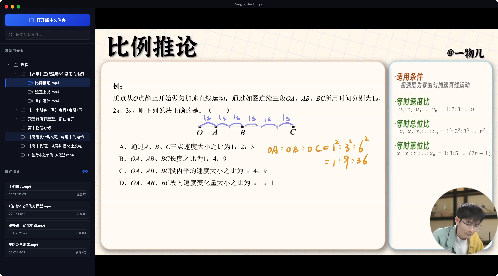

# Rong VideoPlayer

Rong VideoPlayer 是一个面向 macOS 的本地学习辅助工作台，基于 **Electron + HTML5 + FFmpeg** 构建。它最初是一个高兼容本地视频播放器，现在已经扩展为集 **视频学习、Bilibili 下载、视频截图、截图库管理、Markdown 学习笔记、PDF 原生阅读/资料查看、社区分享原型** 于一体的桌面工具。

它适合用来整理课程视频、讲座录像、教程合集、PDF 讲义和电子书资料：一边播放视频或阅读资料，一边截取关键画面、沉淀笔记、插入截图和附件，最终形成可检索、可复盘的个人学习资料库。



> 核心优势：针对 Chromium 原生不支持或兼容不佳的 `.mkv`、`.rmvb`、`.avi` 等格式，主进程会通过 `ffprobe` 探测编码，并在需要时调用 `ffmpeg` 进行本地实时转码或封装，以 HTTP 流形式喂给前端 `<video>` 播放。

---

## 当前功能

### 本地视频播放器

- 导入本地媒体文件夹，并以左侧目录树浏览视频文件。
- 自动过滤非视频文件，隐藏空目录，目录最多递归 6 层。
- 支持 MP4、MKV、RMVB、AVI、FLV、WMV、MOV、WEBM、M4V、TS、3GP 等常见格式。
- 对浏览器可原生播放的文件使用 HTTP Range 方式流式读取，支持进度条拖动。
- 对不兼容格式使用 `ffmpeg` 实时输出 Fragmented MP4 流。
- 自动记录上次打开目录、最后播放文件、播放进度、最近播放列表、音量、主题和自动连播状态。
- 支持文件名搜索，命中项高亮并自动展开父级目录。
- 支持倍速播放、音量控制、全屏、自定义控制条和自动隐藏控制面板。
- 支持播放结束后自动播放下一个视频。

### Bilibili 下载器

- 支持扫码登录 Bilibili，并保存 `SESSDATA` 登录态。
- 支持解析单视频、多 P 视频、合集/UGC season 等链接。
- 支持选择优先画质，并在权限不足时自动降级到可用画质。
- 支持视频流和音频流并发下载，下载完成后调用 `ffmpeg` 合并为 MP4。
- 支持下载队列、任务进度、速度显示、暂停全部、继续全部、取消任务。
- 支持设置最大同时下载数量，当前限制为 1 到 5。
- 支持下载到当前媒体目录、指定子目录或系统下载目录。
- 对 HEVC 视频自动注入 `hvc1` 标记，提升 macOS QuickTime、Finder 预览兼容性。

### 视频截图与截图库

- 播放视频时可通过控制栏截图按钮或 `Option + 1` 快速截取当前帧。
- 截图保存到应用数据目录下的 `Screenshots/` 文件夹，并写入 `screenshots-db.json` 元数据。
- 截图包含源视频路径、视频名称、播放时间点、分类、创建时间等信息。
- 支持按文件夹设置默认截图分类，新截图会自动归入对应分类。
- 截图库支持分类浏览、搜索、全选、批量删除和单张删除。
- 支持大图 Lightbox 预览、上一张/下一张切换。
- 支持复制截图到剪贴板、在 Finder 中显示截图文件。
- 支持从截图跳回原视频的对应播放时间点。

### 学习笔记

- 内置独立的“随堂笔记”视图，数据保存到 `notes-db.json`。
- 支持新建、编辑、保存、删除笔记。
- 支持按分类筛选笔记，分类体系复用截图库分类。
- 支持按标题和正文搜索笔记。
- 支持 Markdown 实时预览。
- 支持 KaTeX 数学公式，例如 `$f(x)=x^2$` 和 `$$a^2+b^2=c^2$$`。
- 支持 Mermaid 图表代码块渲染。
- 支持从截图库选择截图并插入到笔记正文。
- 笔记卡片会自动提取正文中的第一张图片作为缩略图。

### 学习资料上传

- 支持上传 Markdown、TXT、PDF、Word、PPT、Excel、PNG、JPG、JPEG 等资料。
- 上传的资料会复制到应用数据目录下的 `UploadedMaterials/` 文件夹。
- Markdown 和 TXT 会直接读取文本内容并生成资料笔记。
- PDF 资料支持原生阅读器，可直接在应用内展示，并提供类似微信读书的双页阅读与翻页效果。
- 图片会作为 Markdown 图片插入并可在笔记卡片中显示缩略图。
- Word、PPT、Excel 等文件会以附件卡片形式保存，可点击调用系统默认应用打开。

### 在线分享社区原型

- 内置“在线分享社区”页面和交互原型。
- 支持本地 Mock 合集广场、分类筛选、搜索、详情弹窗、点赞状态和一键联动下载器。
- 支持提交新合集，提交内容进入待审核状态。
- 支持隐藏的管理员审核入口，可批准、驳回或下架合集。
- 当前社区数据主要保存在 `localStorage`，属于客户端原型功能，还未接入真实线上后端。

### 设置与主题

- 支持通用设置、播放设置、下载设置、分类管理和关于页面。
- 支持自动恢复上次目录、自动连播、默认播放倍速等偏好设置。
- 支持配置下载目录和最大并发下载数。
- 支持新增、删除截图/笔记分类。
- 支持多套中国传统色彩主题：玄天、竹翠、缃叶、黛墨、凝脂。

### OCR 预留能力

- 项目内置了 macOS Vision OCR 辅助程序源码 `ocr_mac.swift`。
- 打包配置会将编译后的 `bin/ocr_mac` 放入应用资源目录。
- 该能力目前尚未接入渲染进程交互流程，可作为后续“截图识别文字 / 图片资料识别 / 自动生成笔记”的基础。

---

## RoadMap

项目后续会继续围绕“学习辅助工具”演进，核心方向是把视频、笔记、PDF/电子书、截图和资料附件组织成一个统一的个人学习工作台。下面是可以继续开发的功能规划：

### 短期计划

- **视频学习增强**：增加视频书签、时间点标注、章节目录、学习进度统计和“从笔记跳回视频时间点”的更完整联动。
- **截图 OCR 接入**：将 `bin/ocr_mac` 接入主进程 IPC，支持对视频截图、上传图片进行文字识别，并一键插入到当前笔记。
- **笔记体验优化**：支持自动保存、草稿恢复、笔记模板、标签、多条件筛选，以及更清晰的编辑/预览模式切换。
- **PDF 阅读增强**：在原生阅读器基础上继续完善阅读进度、搜索、收藏页、划线摘录和笔记引用能力。
- **资料管理增强**：为上传资料增加统一列表、文件类型筛选、打开原文件、重新命名、删除和关联笔记等操作。

### 中期计划

- **电子书阅读器**：支持 EPUB、纯文本电子书等格式，提供目录、书签、高亮、摘录和阅读进度记录。
- **学习资料库检索**：建立本地全文索引，统一搜索视频文件名、笔记正文、截图 OCR 文本、PDF 文本和上传资料元数据。
- **知识卡片与复习**：从笔记中生成知识卡片、待复习列表和简单的间隔复习视图，帮助把视频学习沉淀为可复盘内容。
- **视频字幕/转写联动**：支持导入字幕文件，按字幕搜索定位视频片段，并将字幕片段引用到笔记中。
- **导出与备份**：支持导出 Markdown、PDF 或资料包，提供本地数据备份、恢复和迁移能力。

### 长期计划

- **统一学习空间**：按课程、主题或项目组织视频、PDF、电子书、截图、笔记和附件，形成独立的学习专题空间。
- **AI 辅助学习**：在用户显式配置模型服务后，提供视频/资料摘要、笔记润色、重点提取、问答和测验题生成等可选能力。
- **跨设备同步**：提供可选的本地网络同步、WebDAV/iCloud Drive 同步或导入导出式同步方案。
- **真实社区与资源分享**：将当前 `localStorage` Mock 社区替换为真实后端，支持合集分享、审核、导入、下载和学习资料协作。
- **工程架构治理**：拆分 `main.js` 和 `renderer.js` 巨型文件，模块化播放器、下载器、截图库、笔记和资料库，并逐步补齐测试、lint 和本地化资源管理。

---

## 技术架构

应用采用 Electron 双进程架构：

### 主进程：`main.js`

主进程负责所有 Node.js、文件系统和系统能力：

- 创建 macOS 桌面窗口，使用隐藏标题栏和自定义 traffic light 位置。
- 启动本地 HTTP 服务，默认监听 `30032` 端口。
- 提供 `/video` 路由，用于本地视频 Range 流式读取或 FFmpeg 实时转码。
- 提供 `/screenshot` 路由，用于安全展示截图、PDF 和上传图片等本地文件。
- 调用 `ffprobe` 探测视频编码、时长和兼容性。
- 调用 `ffmpeg` 进行实时转码、Bilibili 下载音视频合并和 HEVC 标记处理。
- 扫描媒体目录并构建目录树。
- 管理播放历史、截图数据库、笔记数据库和上传资料。
- 管理 Bilibili 登录、解析、下载队列和任务状态推送。

### 渲染进程：`renderer.js` + `index.html` + `index.css`

渲染进程负责所有界面和交互：

- 播放器界面、目录树、搜索、快捷键和播放控制。
- Bilibili 下载工作台和任务列表。
- 在线社区 Mock 页面、合集详情、分享表单和管理员审核弹窗。
- 截图库、分类侧栏、图片网格、Lightbox 和批量操作。
- 学习笔记、Markdown 编辑器、实时预览、截图插入和资料展示。
- 设置页和主题切换。

当前渲染进程启用了 `nodeIntegration: true` 且 `contextIsolation: false`，因此前端可以直接使用 `ipcRenderer.invoke()` 与主进程通信。若未来要切换到更安全的 preload/contextIsolation 架构，需要统一重构 IPC 调用。

---

## 本地数据

应用数据默认写入 Electron 的 `app.getPath('userData')` 目录。常见数据包括：

| 数据 | 说明 |
| :--- | :--- |
| `playback-history.json` | 播放历史、最近播放、上次目录、主题、自动连播、Bilibili 登录态等 |
| `screenshots-db.json` | 截图分类和截图元数据 |
| `Screenshots/` | 视频截图 PNG 文件 |
| `notes-db.json` | 学习笔记数据 |
| `UploadedMaterials/` | 上传的学习资料副本 |
| `PdfCache/` | PDF 原生阅读器渲染页缓存 |

---

## 快速开始

### 环境依赖

请确保 macOS 已安装：

- Node.js，推荐 v18 或更高版本。
- Homebrew。
- FFmpeg，要求 `ffmpeg` 和 `ffprobe` 能在 `PATH` 中找到。

如果还没有安装 FFmpeg：

```bash
brew install ffmpeg
```

### 安装与运行

```bash
npm install
npm start
```

---

## 打包

```bash
# 生成未签名的本地 macOS .app
npm run pack

# 生成可分发的 .dmg
npm run dist

# 使用交互式脚本选择 app / dmg / all
./build.sh
```

构建输出位于 `dist/` 目录。

---

## 常用快捷键

| 按键 | 功能 |
| :--- | :--- |
| `Space` | 播放 / 暂停 |
| `←` | 快退 15 秒 |
| `→` | 快进 15 秒 |
| `↑` | 音量增加 5% |
| `↓` | 音量减少 5% |
| `F` | 切换全屏 |
| `M` | 静音 / 取消静音 |
| `Option + 1` | 截取当前视频帧并保存到截图库 |

---

## 设计文档

项目内已有部分功能设计文档：

- `Docs/screenshot_management_design.md`：视频截图与截图库管理设计。
- `Docs/video_sharing_design.md`：在线视频分享社区设计。
- `CLAUDE.md`：面向代码协作 Agent 的项目结构和开发约定说明。

---

## 开发现状说明

- 当前项目没有配置测试、lint 或 formatter。
- 源码主要集中在根目录的 `main.js`、`renderer.js`、`index.html`、`index.css`。
- `dist/` 是构建输出，不是源码入口。
- UI 文案和代码注释以中文为主，后续新增用户可见内容建议继续保持中文。
